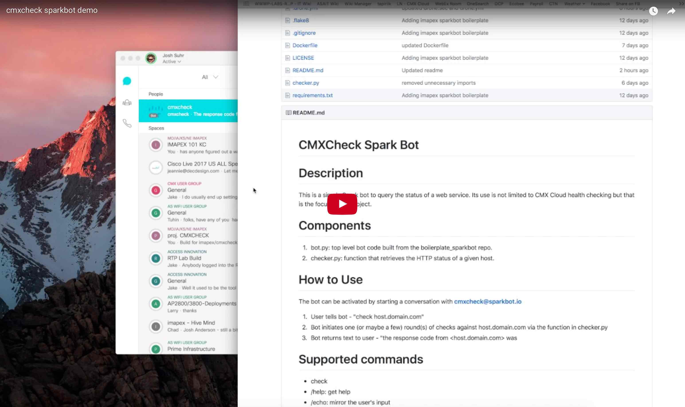

# CMXCheck Spark Bot

# Description

This is a simple Spark bot to query the status of a web service. Its use is not limited to CMX Cloud health checking but that is the focus of this project.

# Demo

# Components

1. bot/bot.py: top level bot code built from the boilerplate_sparkbot repo.
2. bot/helpers/checker.py: function that retrieves the HTTP status of a given host.

# How to Use

The bot can be activated by starting a conversation with **cmxcheck@sparkbot.io**

1. User tells bot - "check host.domain.com"
2. Bot initiates one (or maybe a few) round(s) of checks against host.domain.com via the function in checker.py
3. Bot returns text to user - "the response code from <host.domain.com> was <http-response-code>

# Supported commands

* check
* /help: get help
* /echo: mirror the user's input

# In Development

1. Test branch and pipeline buildout.
2. Improve error checking.
3. Improve status code feedback to user.
4. Add more checks.
  * RTT
  * DNS
  * SRV
5. CMX API integration for stats
